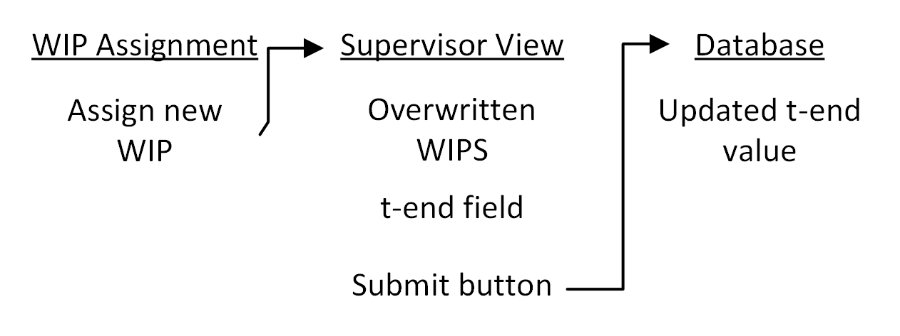

# Deliverable 1
Student Name | Student Number 
---|--- 
Alois Clerc | 300070936 

Capstone project: https://github.com/AlexanderKYu/Digital_Twin_Tag 

Jira board: https://capstonet33.atlassian.net/jira/software/projects/SCRUM/boards/1 

## Problem:
When a tag is assigned to a product in the production line, it is assigned a unique WIP(Work In Progress) number which represents the order number of the product. After a product is complete, the tag must have its WIP number unassigned. Occasionally, the employee at the end of the line forgets to unassign the WIP from the tag. This becomes a problem when the tag is reused for another product and therefore has multiple WIPs. A tag with multiple WIPs causes erroneous data and misleading analytics.

## Appetite:
This large undertaking can be split into multiple “small batch” pieces which are incremental and provide good cutoff points if there isn’t enough time to complete the whole feature. The first small batch would be to remove any old WIP numbers on a tag when a new WIP is assigned. This small fix would already stop a large amount of issues with the data. The second small batch would be to create the front-end view that notifies the supervisor that a WIP is missing an end time. The final small batch would be giving the supervisor the ability to enter an end time, and having that end time updated in the database.

## Solution:
The solution for the first small batch happens entirely on the back end. When the backend receives a request to assign a WIP to a tag, it must first check the database to ensure that there isn’t already a WIP assigned to that tag. If there is a WIP assigned to the tag, remove it from the tag and send the relevant tag information to the supervisor view of the front end. The solution for the second small batch would be implemented on the Supervisor view of the front end. A new component will need to be created to display all of the WIPs that were overwritten. In this component, the supervisor must also be able to enter end times for each overwritten WIP. Finally, the end times entered by the supervisor must be updated in the database.
Below is a breadboard of the potential solution:

 ## Rabbit Holes
The most essential part of this feature is that old WIPs are wiped after new ones are reassigned. The feature where the supervisor can directly add the t-end for any overwritten WIPs is nice and would increase productivity for the user, but it is ultimately not essential. If implementing front-end components for the supervisor view ends up taking too much time from the cycle, it may be better to simply abandon it and prioritize the back-end components of the feature. In the worst case scenario, t-end could be manually updated with SQL queries since supervisors have access to the database.
